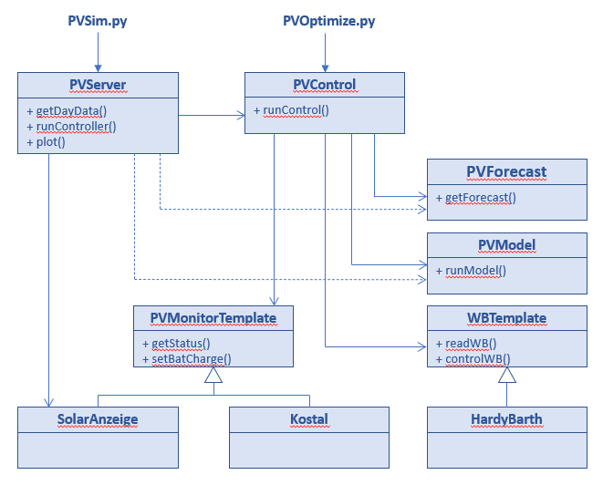

# PVOptimize
Optimize energy usage produced by a rooftop PV (photo voltaic) system

## Introduction
This project aims at making best use of PV rooftop installations. This is done by implementing a controller which on a regular basis (eg. every minute) controls power distribution.

Current implemented functionality includes:
* PV excess charging with [Hardy Barth](https://www.echarge.de/de/home) wallbox
* smart home battery charging with excess energy during PV peak production, avoiding grid feed-in limits of network provider. This is implemented for [Kostal Plenticore](https://www.kostal-solar-electric.com/en-gb/products/hybrid-inverter/plenticore-plus) inverters.
* control the above based on PV output forecasts, as generated with the sister project [PVForecast](https://github.com/StefaE/PVForecast)

The controller algorithm can be simulated based on historic PV data, as stored by data loggers such as eg. [Solaranzeige](https://solaranzeige.de/phpBB3/solaranzeige.php). This allows to understand, debug and optimize control algorithms. Once one is happy with the algorithm, it can obviously be applied to the supported hardware. In that usage scenario, the controller is typically called from a crontab entry on a Raspberry Pi.

It is very likely that a user of this project wants to do adaptions and modifications according to his needs, either to the algorithms or supported hardware. Hence, the documentation focuses on the software structure more than trying to be a simple users guide. The software is structured such that different hardware components can easily be added. At this moment, the above mentioned wallbox and (single) inverter are the only ones supported. Python knowledge will be required for adaptions.

This file mainly focuses on the software structure, whereas a functional overview is given [here](https://stefae.github.io/PVOptimize/)

**Note: all time stamps used in this project are UTC**

Improvements are welcome - please use *Issues* and *Discussions* in Git.
-------------
## Table of Content
  * [Introduction](#introduction)
  * [Main scripts](#main-scripts)
  * [Class Model](#class-model)
    + [Simulator Mode](#simulator-mode)
    + [Active Controller Mode](#active-controller-mode)
  * [Source File Structure](#source-file-structure)
  * [Configuration file](#configuration-file)
  * [Hardware specific implementations](#hardware-specific-implementations)
    + [PVMonitor](#pvmonitor)
    + [Wallbox](#wallbox)
    + [Extending with new hardware providers](#extending-with-new-hardware-providers)
  * [Influx database](#influx-database)
  * [Installation](#installation)
  * [To Do](#to-do)
  * [Acknowlegements](#acknowlegements)
  * [Disclaimer](#disclaimer)
  * [License](#license)

<small><i><a href='http://ecotrust-canada.github.io/markdown-toc/'>Table of contents generated with markdown-toc</a></i></small>

-------------

## Main scripts

Two main scripts exist:

| Script | Purpose |
|--------| --------|
| `PVOptimize.py`| executes one call call to `Class PVControl` and exits. This is typically running on a Raspberry Pi and called every minutes from a crontab entry to regulate the wallbox and home battery charging. |
| `PVSim.py` | simulates one or multiple days of using `Class PVControl` based on historical data. This is typically called on a performant computer in interactive mode to understand the control algorithms implemented in `Class PVControl`. |

## Class Model
The following shows the class model:



### Simulator Mode
When running in _simulator_ mode (`PVSim.py`) a `PVServer` object is created and `pvstatus = PVServer.getDayData()` is called for every day to be simulated. It fetsches full day data from `SolarAnzeige` and then iterates over all timestamps within the current day with calls to `SolarAnzeige.getStatus()`.

Likewise, a `PVForecast` object is created and filled with the current day forecast information through `pvforecast = PVForecast.getForecast()`.

Lastly, a `carstatus` dictionary is filled with EV status (connected, ...).

For every time stamp a `PVControl` object is created and the controller is executed with `PVControl.runControl(pvstatus, pvforecast, carstatus)`. This guarantees that the `PVControl` object only lives for one single time stamp, as if it was called from a `crontab` entry through `PVOptimize.py`.

Accumulated information (together with PV clear-sky performance estimates through a `PVModel` object) is digested and finally plotted through `PVServer.plot()`.

### Active Controller Mode
When in _active controller mode_ `PVOptimize.py` is called regularly (eg. every minute) from a `crontab` entry and creates a `PVControl` object (similar to what `PVServer` did in simulator mode).

Next it calls `PVControl.runcontrol()` without parameters. This causes `PVControl` to fetch `PVForecast.getForecat` data, PV status data (`<PVMonitor provider>.getStatus()` and wallbox status (`<WBprovider>.readWB()`)

It then calculates what needs be done and controls the PV system through `<PVMontor provider>.setBatCharge()` and the wallbox through `<WBprovider>.controlWB()`.

PVMonitor and Wallbox providers can be easily added through the respective factories, as long as they adhere to the respective template requirements. That, for example, also means that `SolarAnzeige` can be used as a PVMonitor provider in case another inverter than Kostal is used. The method `SolarAnzeige.setBatCharge()` is empty however, meaning that home battery charging cannot be controled. However, the wallbox will still be controlled.

## Source File Structure
```
./
├── Readme.md                        # this file
├── docs                             # more documentation files, incl.
|   └── index.md                     # functional overview of the project
├── PVOptimize.py                    # main script to run controller, invoked from crontab
├── PVOptimizeSim.py                 # script to simulate controller
├── config.ini                       # configuration file
|
├── PVControl
│   ├── pvcontrol.py                 # main PV controller
│   ├── pvforecast                   # provide PV output forecast to controller
│   │   └── pvforecast.py
│   ├── pvmodel
│   │   ├── pvmodel.py               # simulator of a PV system, based on pvlib
│   │   └── forecast.py
│   ├── pvmonitor                    # hardware specific implementations for PV monitoring
│   │   ├── kostal.py                # inverter implementation (includes control routines)
│   │   ├── solaranzeige.py
│   │   └── pvmonitortemplate.py     # base-class for all pvmonitor sub-classes
│   ├── pvmonitorfactory.py
│   ├── wallbox                      # hardware specific implementations for wallboxes
│   │   ├── hardybarth.py
│   │   └── wbtemplate.py            # base-class for all wallbox sub-classes
│   ├── wallboxfactory.py
│   └── pvserver.py                  # simulator environment for pvcontrol.py
├── pvcontrol.pickle
└── dump_pickle.py                   # helper script to dump .pickle file (for debugging)
```

Besides the source files (`*.py`) two files serve a special purpose:

| File | Purpose |
|------|---------|
| `pvcontrol.picke` | since a new `Class PVControl` object is created and distructed every minute, it has no notion of history. The file `pvcontrol.pickle` is a [pickle](https://docs.python.org/3/library/pickle.html) serialization of required historical data. It is recreated from scratch whenever `PVControl` finds that the last saving is longer ago than 10min. It can be dumped for debugging purposes with `dump_pickle.py`.
| `config.ini` | configuration file, described in next chapter.

`pvmodel.py` is a copy-exact of the corresponding class in the PVForecast project.

## Configuration file

Both scripts read a file `config.ini` (or whatever is provided with `-c` command line option). It is parsed with python's [configparser](https://docs.python.org/3/library/configparser.html). Most importantly:
* items can be promoted to the `[DEFAULT]` section if same `key = value` pair is used in multiple sections
* inline comments are configured to start with `#`
* multi-line values are not allowed
* out-commented `key = value` pairs show the respective default options, which could be changed as needed

The `config.ini` file provided with the distribution documents each item in detail. It consists of the following sections:

| Section | Purpose |
|---------|---------|
| `[PVControl]`  | configuration of actual controller
| `[HardyBarth]` | information about the Hardy Barth wallbox |
| `[Kostal]`     | information about Kostal Plenticore inverter |
| `[Solaranzeige]` | information about the `solaranzeige` Influx database |
| `[PVForecast]`   | information about the PV output forecast Influx database |
| `[PVSystem]`     | information about the PV system - used by `PVModel()`. Content is documented in sister project [PVForecast](https://github.com/StefaE/PVForecast#forecast-models) - only the `clearsky` model is used here. |
| `[PVStorage]`    | information about the home battery storage |
| `[PVServer]`     | control of `Class PVServer()` |

## Hardware specific implementations

### PVMonitor

Implementations are sub-classed to `PVMonitorTemplate()`. Two classes currently exist:

| Class | Purpose |
|-------|---------|
| `SolarAnzeige()` | gets PV status information from an Influx database of `solaranzeige`. Current implementation is specific to a `solaranzeige` instance configured for a *Kostal Plenticore* inverter (hardware code 17) |
| `Kostal()`       | *Kostal Plenticore Plus* inverter with software version 1.18 and above. This software version allows for a more granular battery charging control (see [Operating Manual](https://www.kostal-solar-electric.com/en-gb/download/download#Solar%20Inverter/PLENTICORE%20plus/United%20Kingdom/), chapter *external battery control*). Access to this extended control must be enabled role *Installer* in the Kostal configuration menu. It must be set to `Control via Modbus (TCP)`

`Kostal()` will not work without *external battery control* enabled. It further assumes (but does not verify) that *Timeout for ext. battery control [s]* == 180. (It would be possible without too much functionality loss to relax on this requirement)

`SolarAnzeige()` is automatically used by `PVSim.py`, but can also be configured as a `PVMonitor` provider for `PVOptimize.py`. In that case, forecast based home battery charging is not available.

### Wallbox

Only available provider for now is _HardyBarth_

### Extending with new hardware providers

The implementations have to follow the requirements documented in the abstract template classes `PVMonitorTemplate` and `WBTemplate` respectively. 

They are called from the factories `PVMonitorFactory` and `WallBoxFactory` respectively.

## Influx database

In active mode, an Influx database is used to log performance of the controller. Three `measurements` are created:
| Measurement | Purpose | Documentation |
|-------------|---------|---------------| 
| `ctrlstatus` | Status of controller - all fields are calculated in class `PVControl` | `PVControl._logInflux()` |
| `wbstatus`   | Status information read from Wallbox | `WBTemplate.readWB()` (and actual implementation) |
| `pvstatus`   | Status of PV system read from PVMonitor provider | `PVMonitorTemplate.getStatus()` (and actual implementation) |

## Installation

Follow installation instructions for the **full** installation of the sister project [PVForecast](https://github.com/StefaE/PVForecast#full-installation). This is required because:
* we make use of [pvlib](https://pvlib-python.readthedocs.io/en/stable/) clearsky performance modeling of the PV system
* want to make use of PV forecast data, as is provided by that project (although another forecast source could be configured as long as its available in an Influx database)

In addition, the simulator `PVServer` requires [mathplotlib](https://matplotlib.org/stable/index.html). 

All references to _Influx_ work only with Influx 1.x (tested: 1.8).

Note that the project assumes that UTC midnight is in the dark hours of the day throughout the year. That
means that the project might not work immediatly as expected in the Americas or Asia.

## To Do
* currently, only excess car charging is supported - this is obviously insufficient when overnight charging is required, or in winter. Adequate control needs be provided:
  + if I_gridMax > 0, discharging battery must be limited to I_bat (currently, with I_gridMax > 0, battery is discharged until minSOC)
  + charging is currently terminated if remaining PV power no longer can charge battery to maxSOC, which doesn't make sense in winter
  + ...
* `ZOE mode`: At low charge currents, _Renault Zoe_ has large reactive power (cos-phi < 0.5). `I_min` (and possibly `I_max`) should then automatically be increased
* GUI for easy control

## Acknowlegements
Login procedure Kostal._LogMeIn() is derieved from [kilianknoll](https://github.com/kilianknoll/kostal-RESTAPI)

## Disclaimer
The software controls hardware (Inverter, Wallbox, ...) over APIs and hence can potentially cause harm to the hardware and its environment. 
The author cannot be held liable for any damage caused through its use.

**Use at your own risk!**

Further warranty limitations are implied by the license

## License
Distributed under the terms of the GNU General Public License v3.
