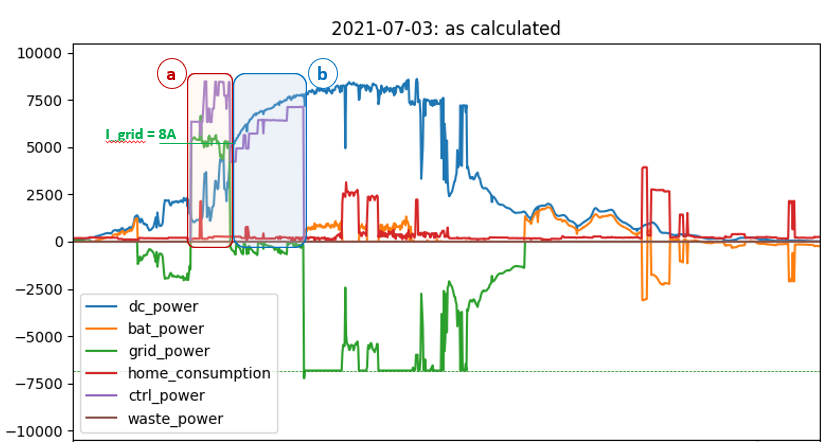

# PVOptimize
Optimize energy usage produced by a rooftop PV (photo voltaic) system

## Introduction
This project aims at making best use of PV rooftop installations. This is done by implementing a controller which on a regular basis (eg. every minute) controls power distribution.

Current implemented functionality includes:
* PV excess charging with [Hardy Barth](https://www.echarge.de/de/home) wallbox
* smart home battery charging with excess energy during PV peak production, avoiding grid feed-in limits of network provider. This is implemented for [Kostal Plenticore](https://www.kostal-solar-electric.com/en-gb/products/hybrid-inverter/plenticore-plus) inverters.
* control the above based on PV output forecasts, as generated with the sister project [PVForecast](https://stefae.github.io/PVForecast/)

The behavior of the controller is configured in a `config.ini` file, or can be controled from a GUI dashboard of the sister project [PVControl](https://github.com/StefaE/PVControl).

The controller algorithm can be simulated based on historic PV data, as stored by data loggers such as eg. [Solaranzeige](https://solaranzeige.de/phpBB3/solaranzeige.php). This allows to understand, debug and optimize control algorithms. Once one is happy with the algorithm, it can obviously be applied to the supported hardware. In that usage scenario, the controller is typically called from a crontab entry on a Raspberry Pi.

It is very likely that a user of this project wants to do adaptions and modifications according to his needs, either to the algorithms or supported hardware. Hence, the documentation focuses on the software structure more than trying to be a simple users guide. The software is structured such that different hardware components can easily be added. At this moment, the above mentioned wallbox and (single) inverter are the only ones supported. Python knowledge will be required for adaptions.

This page mainly focuses on a functional overview whereas some background to the software structure is given [here](https://github.com/StefaE/PVOptimize#readme)

**Note: all time stamps used in this project are UTC**

Improvements are welcome - please use *Issues* and *Discussions* in Git.

------------
## Table of Content
- [PVOptimize](#pvoptimize)
  - [Introduction](#introduction)
  - [Table of Content](#table-of-content)
  - [Concepts](#concepts)
    - [Home battery management](#home-battery-management)
      - [`minSOC` and `maxSOC`](#minsoc-and-maxsoc)
      - [Grid feedin limitations](#grid-feedin-limitations)
      - [Home battery and EV charging](#home-battery-and-ev-charging)
      - [Forecast based home battery charging](#forecast-based-home-battery-charging)
      - [Summary of battery charging control parameters](#summary-of-battery-charging-control-parameters)
    - [EV charging management](#ev-charging-management)
  - [Examples of what the controller can do](#examples-of-what-the-controller-can-do)
    - [EV excess charging example](#ev-excess-charging-example)
    - [Interplay of `I_gridMax`, `I_min` and `I_max`](#interplay-of-i_gridmax-i_min-and-i_max)
    - [Home battery charging example](#home-battery-charging-example)
  - [What does the simulator do?](#what-does-the-simulator-do)
    - [Overview](#overview)
    - [A closer look at simulator output](#a-closer-look-at-simulator-output)
    - [Battery charging forecast on a winter day](#battery-charging-forecast-on-a-winter-day)
    - [Some more notes](#some-more-notes)
  - [Disclaimer and License](#disclaimer-and-license)
  - [License](#license)

<small><i><a href='http://ecotrust-canada.github.io/markdown-toc/'>Table of contents generated with markdown-toc</a></i></small>

------------
## Concepts

### Home battery management
#### `minSOC` and `maxSOC`
During an annual cycle of observing the performance of a home battery, one observes the following issues:
* in summer, nights are short and battery typically fully charged at end of the day. As a result, discharging at night time with the background home consumption results in a morning SOC of maybe 60%. That is, the battery never gets fully discharged.
* in winter, nights are long and home consumption is larger (eg. due to circulation pumps of central heating, etc.). Sunlight is rare and fully charging the battery is often not possible. However, in the morning, it will regularly be fully discharged.

Batteries neither like to be fully charged or discharged for an extended period of time. Hence, it is advantageous to define a `maxSOC` during summer which is <100% and a `minSOC` > 5% in winter (where 5% is the battery provider default for 'fully discharged' state).

If, for example, in summer we define `maxSOC` = 80%, discharging will still only reach 40% in the morning - more than enough. Conversely, in winter, setting `minSOC` to eg. 20% still allows adding 80% charge, which is unlikely to be possible in cloudy winter days.

This general rule is of course not valid during long rainy summer periods or long sunny winter periods. In a future verison of this project, longterm [PVForecast](https://stefae.github.io/PVForecast/) may implement an automatic management of `minSOC` and `maxSOC`, but this is currently not available yet.

#### Grid feedin limitations
Regulatory requirements may limit grid feedin. In Germany for example, a rooftop PV installation basically may never feed in more than 70% of its nominal power. This leads to clamping solar production during peak hours in summer and hence energy waste. It is advantageous to charge a home battery with this excess power.

This clamping of course can only happen around noon: in the morning and evening, <70% of nominal power will be generated even in full sun. `PVOptimize` knows from a clear-sky model (using [pvlib](https://pvlib-python.readthedocs.io/en/stable/)), during which periods of the day, in principle clamping is possible.

Hence, it will try to delay charging until this period ends. If excess power is produced prior to that moment, the battery will be charged, but charge current will be limited to the excess power.

#### Home battery and EV charging
We want to use PV power to charge an EV. Unfortunatly, PV power can fluctuate heavily and rapidly, which would result in large oscillations of EV charge current. `PVOptimize` tries to dampen these fluctuations by allowing limited use of the home battery to charge the EV:
* if PV power suddenly drops, charging may continue for several minutes out of the home battery
* this home battery support is stronger if the battery SOC is higher, and less if its lower

To enable this, `PVOptimize` steers any excess PV power to home battery charging even early in the morning, if an EV is connected to the wallbox, but PV power is yet insufficient to charge the EV. Also, every excess PV power during EV charging (resulting eg. from rounding errors - some wallboxes can control charge currents only in 1A steps) is moved to the battery. Hence, it tries to keep the home battery well charged, if an EV is connected (hence, awaiting charging). However, this `fastcharge` mode is used only until the home battery SOC has reached `maxSOCCharge`.

In addition, `minSOCCharge` makes sure that EV charging is only started once the home battery SOC has reached a desired minimal level. This can be used eg. in spring or autumn to first partially or fully charge the home battery and then steer any excess power to an EV.

#### Forecast based home battery charging
If PV excess charging (`I_gridMax = 0`) is in motion, PV Forecast data from [PVForecast](https://stefae.github.io/PVForecast/#forcast-horizon) is used to abort EV charging early enough, so that home battery can still be fully charged to `maxSOC` prior to sunset.

#### Summary of battery charging control parameters
The following parameters can be set in the `[PVControl]` section of the `config.ini` file:

| Setting | Effect |
|---------|--------|
| minSOC  | controls minimal SOC level of home battery. There is an absolute minimum defined in `PVStorage.minSOC`, but in winter times, where anyway insufficient PV power is available to fully charge battery, one may set a higher level. |
| maxSOC  | controls maximum SOC level of home battery. In summer, were not all battery capacity is needed to support home consumption at night time, one might lower this value from 100% to eg. 80% |
| minSOCCharge | Home battery is charged to at least this level prior to EV charging to start. This has two reasons: (a) one may want to give priority to home battery charging with `minSOCCarge` = 100%. Then, EV charging starts once this SOC level is reached. (b) during EV excess charging, home battery can support short shadow periods. However, support is programmed to be dependent on SOC level to avoid too heavy battery cycling. Hence, one may choose to have battery at least 50% full before EV charging starts. (For the same reason, the home battery is charged at maximum rate if an EV is plugged in, but power is insufficient to start charging) |
| maxSOCCharge | Prior to EV charging being completed, home battery will not be charged above this level. Purpose to keep some battery capacity available in case EV charging finishes early and PV power  would otherwise run into grid feed-in limits. |

### EV charging management
Fundamentally, we can distinguish between three desired modes of operations:
* charge only from PV excess power - EV may or may not get fully charged.
* charge from grid as needed, if PV does not provide sufficient power - this is typically done if EV must be fully charged, regardless of PV state.
* charge as much as possible from PV, but we know that PV is insufficient to charge EV and we need some support from grid

These modes are controlled with the following settings:

| Setting | Effect |
|---------|--------|
| I_max | Maximum current provided for EV charging. This level can only be reached if sufficient PV power is available to support the difference `I_max - I_gridMax`. <br/> <br/> Reason to set this lower than maximum current supported by wallbox are days where some PV power is available and we want extent the duration of EV charging, to make use of 'all the sun we get' |
| I_min | Minimum current required to start EV charging. <br/> <br/> If `I_min` can be supplied from PV alone, grid power support will be denied. Hence, if fastest charging is needed, this shall be set high and `I_gridMax` shall allow for sufficient grid power support. |
| I_gridMax    | Maximum grid power to be used for EV charging. If set to 0A, only PV excess charging is possible. If set to `I_max`, potentially all energy could come from grid. If `0A < I_gridMax < I_max` it defines the maximum current which can be drawn from grid for EV charging (after having accounted for home consumption). <br/> <br/> If PV power is insufficient for `I_min`, grid power will be used and charge current maximized (respecting `I_max`). Use home battery for EV charging will be inhibited and no attempt will be made to charge home battery before end of the day. See next section for more details and an example. |

The special value `I_max = 0` disables control of the wallbox, so that native wallbox control can be used again, without interference from `PVOptimize`.

## Examples of what the controller can do
The following examples show different aspects of the capabilities of the controller.

### EV excess charging example

The following example assumes that sufficient PV energy is available to charge EV. During intermittent shadow periods, the home battery is used to support charging to 'some extent'. Grid power is not allowed to be used. The relevant `config.ini` settings are in section `PVControl`:

| Setting | Value | Comment |
|---------|-------|---------|
| I_min   | 8A    | start charging once PV supports a charge current of at least 8A |
| I_max   | 16A   | allow charging with a current as high as 16A (11kW)             |
| I_gridMax | 0A  | don't allow grid power to support charging                      |


| Label | Comment |
|-------|---------|
| a | In the case shown, the EV has been connected to the wallbox the evening before. Due to this connection status, the home battery is always charged as quick as possible when PV power is available but insufficient to charge the car |
| b | Although PV power drops below minimum required charge current `I_min` (here, 8A ~ 5.7kW) charging is maintained for a certain time (which depends on home battery SOC) |
| c | Once car charging is completed, home battery is no longer charged unless ... |
| d | ... there is PV excess power (here: >6.8kW) which cannot be fed to the grid due to network provider limitations |
| e | after a PV clear-sky model predicts that it is no longer possible to have PV excess power for the day (here ~15:13), home battery charging is released. |

### Interplay of `I_gridMax`, `I_min` and `I_max`

The following simulation was run with

| Setting | Value |
|---------|-------|
| I_gridMax | 8A   |
| I_min     | 6A   |
| I_max     | 12A  |

In period (a), PV power (blue) is insufficient to supply `I_min`. Hence, max. `I_gridMax = 8A` are drawn from grid (green), ensuring that total charge current does not exceed `I_max = 12A`.

In period (b), PV power exceeds `I_min = 6A` and the grid is no longer used. Charging now follows the capabilities of the PV system until the EV is charged.



This example as shown is probably not a very practical use-case, but it illustrates the working of the controller. Practically, the user might configure as follows:

* If in a hurry, or if we expect a cloudy day, one would set `I_min = I_max = I_gridMax` to ensure immediate and fastest possible charging, independent of the EV system.
* If we have a little more freedom when the EV must be fully charged, but we still don't expect the day to be sunny enough to do all from excess power, a scenario as in (a) may be configured
* On a sunny day as shown and if full EV charging is not mandatory, one would probably either set `I_gridMax = 0A` to do only excess charging, as shown in period (b). Or, if in a hurry, 

### Home battery charging example


On the above "slow" day for PV power, battery charging is started much earlier (~13:15). 

This is because the controller calculates every minute `ctrlstatus.have`, which is the PV power forecasted for the rest of the day minus the current consumption, extrapolated until end of production. This available power is then compared with the needed power to fully charge the battery (to the specified `maxSOC`), shown as `ctrlstatus.need`. 

If `have < 2*need`, battery charging is released. Note that the high home consumption at ~15:30 results in `need > have`: if this high consumption continues for the rest of the day, the battery is not expected to be chaarged. However, around 16:00, home consumption is small, but still `need > have`. It appears that the forecast at this time was more pessimistic than actual PV production turned out to be. Hence, we were a bit lucky, that the battery still ended up fully charged at 18:00.

## What does the simulator do?
### Overview

The following picture shows typical output of the simulator:


The left side shows the data as monitored and stored by _Solaranzeige_ into an Influx database:

| Trace | Interpretation |
|-------|----------------|
| `dc_power` | DC power generated by the PV system |
| `bat_power` | power to (positive) / from (negative) home battery system |
| `grid_power` | power from (positive) / to (negative) power grid |
| `home_consumption` | home consumption as reported by inverter (_Kostal_) |
| `dc_clearsky` | maximum expected DC power of PV system under clearsky conditions, as modelled by [pvlib](https://pvlib-python.readthedocs.io/en/stable/index.html) |
| `soc` | battery SOC as reported by inverter (_Kostal_) |
| black dotted | feed-in limit |
| blue dotted  | feed-in limit / Inverter Efficiency: This is roughly the feed-in limit to be compared with `dc_power` |
| green dotted | -(feed-in limit) |

The right side shows how the picture would have looked like if the controller performed its job. Additional traces are shown:

| Trace | Interpretation |
|-------|----------------|
| `ctrl_power` | Power dispatched by controller to its specific consumer(s). Currently, only a wall-box is supported |
| `waste_power` | Power wasted as we run into feed-in limitations imposed by the network provider |
| `bat_forecast%` | Residual forecasted PV power for the day compared to power needed to then needs to fully charge battery |

To calculate the right hand picture, the simulator (`PVServer`) was configured as follows in the `config.ini` file:

```
[PVServer]
    # ------------------------------------------------ simulation control
    startDate          = 2021-05-15     # start date of simulation
    endDate            = 2021-05-15     # end date of simulation
    connectTime        = 10:00          # time when EV is connected to the wallbox for charging
    chargePower        = 13000          # total power we want to charge

    # startSOC         = 0.05           # SOC at sunries - default: SOC from database
    maxConsumption     = 4500           # limit home consumption to this (default: no limit = 99999)
    baseConsumption    =  350           # ... if limit is reached, replace with this
    sigmaConsumption   =    0           # ... +- this (sigma); zero = fixed value
    feedInLimit        = 6825           # limit grid feedin [W] (due to regulatory rules; default: no limit = 99999)

    # breakTime        = 15:44          # allows to set a debugging break point

    # ------------------------------------------------ output
    storePath          = ./temp/        # storage path for files generated; plot files will be <day>.png
    storePNG           = 0              # store PNG files (instead of interactive display)
    # maxY             = 10000          # defines y-axis of plots
```

The first few lines tell the simulator that we want to
* pull data for May 15th, 2021 from the _SolarAnzeige_ database
* connect an EV at 10:00 to the wallbox
* charge a maximum of 13kWh

The _SolarAnzeige_ data may of course already contain home consumption related to eg. wallbox charging. Hence, the simulator will adjust `home_consumption > maxConsumption` to `baseConsumption +- sigmaConsumption` before it does any other task.

The resulting picture can either be shown on-screen (`storePNG = 0`) or to disk at `storePath`. This is most useful if the interval `startDate .. endDate` spans a long interval. A daily summary will saved at the same location into a file `summary.csv`.

This way, a scenario (such as _connect the car at 10:00 and try charging 13kWh_) can be evaluated against PV data from eg. _June 2020_.

### A closer look at simulator output

The following annotated picture lets us explain in a little more detail how the simulater helps to understand the controller:


| Label | Comment |
|-------|---------|
| a     | home consumption (as observed by _SolarAnzeige_) is cut as it exceeds `maxConsumption` and replaced with `baseConsumption +- sigmaConsumption` |
| b     | as a consequence of `a`, more power is fed to the grid. The home battery is not yet charged, as it's early in the day |
| c     | PV power exceeds feed-in limit. Excess power is re-directed to the battery |
| d     | at 10:00 car is connected to wallbox. Since there is sufficient PV power, charging starts immediatly |
| e     | as PV power drops, car charging is maintained up to a certain limit. Charge power is provided from battery |
| f     | PV power drops below the need of car charging. Since - based on `dc_clearsky` - there is no hope anymore for the day to charge from PV, charging is stopped (no battery power diverted to car anymore)

This simulator run also created the following text output:

```
ctrl_power          12262.764333               # power managed by controller (delivered to wallbox)
dc_power            27128.286999               # PV DC power produced throughout the day
home_consumption     4664.889500               # home consumption (not considering ctrl_power)
grid_power          -8566.500378               # net power delivered (<0) to grid
bat_power            1128.773400               # net power delivered (>0) to home battery
waste_power             0.000000               # power wasted due to feed-in limit
Name: 2021-05-15 00:00:00, dtype: float64      # date for which this output is valid
```

### Battery charging forecast on a winter day
The concept of `bat_forecast%` may come across a little abstract when just looking at the above plots, created from spring days with enough PV power. So, let's check out a January day:


Shortly before 9:00, SOC reaches its lowest level of 32%. The solar forecast predicts:
* battery capacity = 7680Wh
* needed to acheive full charge: (1 - 0.32)*7680 = 5222Wh
* based on forecast (here, [Solcast](https://solcast.com/)) and current home consumption (340W), it is expected, that only 64% can be provided to end-of-day.
* that would lead to an expected SOC at end-of-day of 0.32 + (1 - 0.32)*0.64 = 75%
* as a matter of fact, at end of day (~15:00 UTC = 16:00 CET), we have acheived SOC = 54%
* obviously, the calculation was not aware of the home consumption peaks annotated with (a), which depleted the battery by ~8% instead of charging during that period - hence a net loss of ~10%. Hence, we cannot expect more than approx. 75% - 10% = 65%

The remaining loss is due to
* forecast changing over period of day (a)
* forecast being slightly too optimistic after approx. 12:00 UTC (b)


The algorithm currently doesn't take advantage of the confidence interval information provided by Solcast. However, the latest version of [PVForecast](https://github.com/StefaE/PVForecast) queries Solcast more often (every 15min by default, 30min for dual-array configurations) than shown here (once per hour), to improve accuracy for short look-ahead periods.

### Some more notes

If `breakTime` is set in `config.ini`, the code will reach a `print` statement in `pvserver.py`, where a breakpoint can be set for further debugging.

`waste_power` can only be calculated to the extend that _SolarAnzeige_ has un-clipped data, for example, because despite high PV production, the feed-in limit was not reached, due to high home consumption rate or battery charging.

If the controller is configured with
```
[PVControl]
    run                =  0
```
it is disabled and only the left side pictures are generated. This can eg. be used to create a gallery of the PV system performance over last year or so.


## Disclaimer and License
The software controls hardware (Inverter, Wallbox, ...) over APIs and hence can potentially cause harm to the hardware and its environment. The author cannot provide any warranty for correctness or specific functionality of this software, nor can he be held liable for any damage caused through its use.

**Use at your own risk!**

Further warranty limitations are implied by the license

## License
Distributed under the terms of the GNU General Public License v3.
