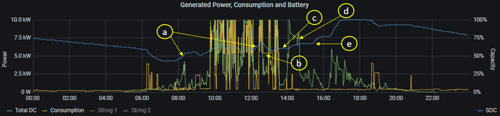
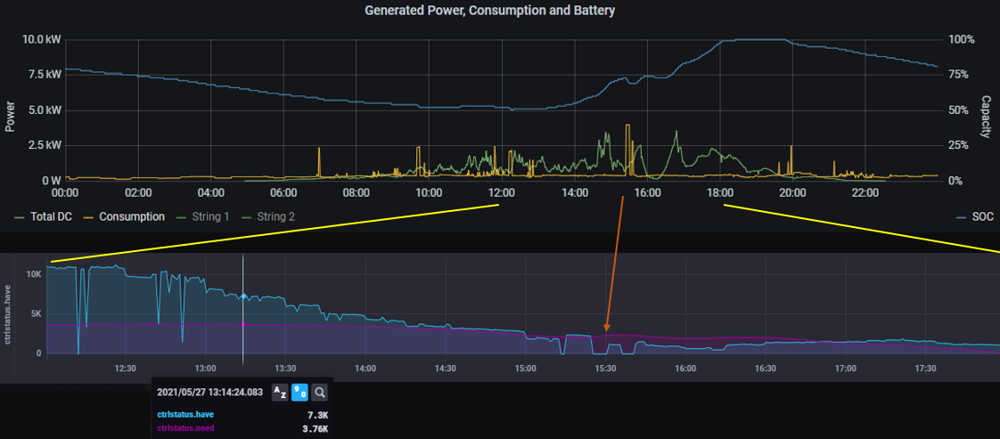
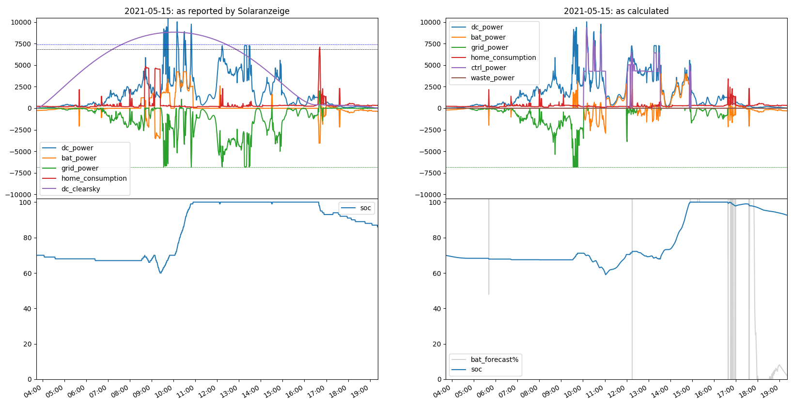
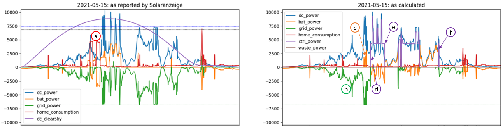
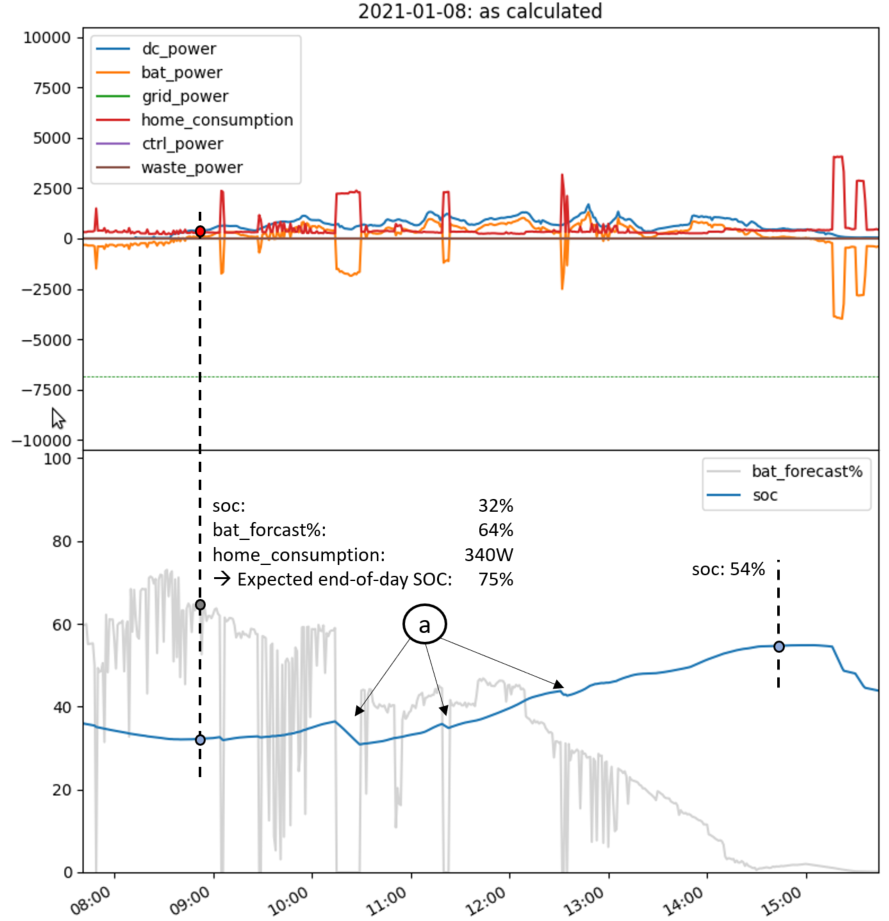
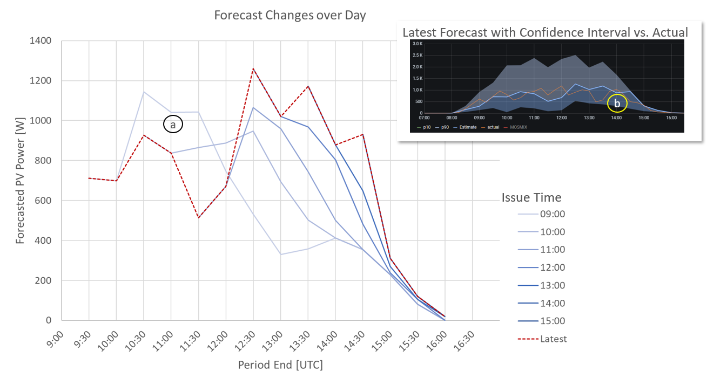

# PVOptimize
## Introduction
This project aims at making best use of PV rooftop installations. Current implemented functionality includes:
* PV excess charging with [Hardy Barth](https://www.echarge.de/de/home) wallbox
* smart home battery charging with excess energy during PV peak production, avoiding grid feed-in limits of network provider. This is implemented for [Kostal Plenticore](https://www.kostal-solar-electric.com/en-gb/products/hybrid-inverter/plenticore-plus) inverters.
* control the above based on PV output forecasts, as generated with the sister project [PVForecast](https://github.com/StefaE/PVForecast)

The controller algorithm can be simulated based on historic PV data, as stored by data loggers as eg. [Solaranzeige](https://solaranzeige.de/phpBB3/solaranzeige.php). This allows to understand, debug and optimize control algorithms. Once the one is happy with the algorithm, it can obviously applied to the supported hardware. 

The software is structured such that different hardware components can easily be added. However, at this moment, the above mentioned wallbox and (single) inverter are the only ones supported.

It is very likely that a user of this project wants to do adaptions and modifications according to his needs, either to the algorithms or supported hardware. Hence, the documentation focuses on the software structure more than trying to be a simple users guide. Python knowledge will be needed.

This file mainly focuses on a functional overview whereas some background to the software structure is given [here](https://github.com/StefaE/PVOptimize#readme)

**Note: all time stamps used in this project are UTC**

Improvements are welcome - please use *Issues* and *Discussions* in Git.

------------
## Table of Content
- [Introduction](#introduction)
- [Table of Content](#table-of-content)
- [Examples of what the controller can do](#examples-of-what-the-controller-can-do)
  - [EV charging example](#ev-charging-example)
- [What does the simulator do?](#what-does-the-simulator-do)
  - [Overview](#overview)
  - [A closer look at simulator output](#a-closer-look-at-simulator-output)
  - [Battery charging forecast on a winter day](#battery-charging-forecast-on-a-winter-day)
  - [Some more notes](#some-more-notes)
- [Disclaimer and License](#disclaimer-and-license)
- [License](#license)

<small><i><a href='http://ecotrust-canada.github.io/markdown-toc/'>Table of contents generated with markdown-toc</a></i></small>

------------
## Examples of what the controller can do
The following examples are based on the current implementation status, which is still fairly restricted (for example, night time EV charging is not yet supported, which is a very obvious need).

### EV charging example



| Label | Comment |
|-------|---------|
| a | In the case shown, the EV has been connected to the wallbox the evening before. Due to this connection status, the home battery is always charged as quick as possible when PV power is available but insufficient to charge the car |
| b | Although PV power drops below minimum required charge current `I_min` (here, 8A ~ 5.7kW) charging is maintained for a certain time (which depends on home battery SOC) |
| c | Once car charging is completed, home battery is no longer charged unless ... |
| d | ... there is PV excess power (here: >6.8kW) which cannot be fed to the grid due to network provider limitations |
| e | after a PV clear-sky model predicts that it is no longer possible to have PV excess power for the day (here ~15:13), home battery charging is released. |



On the above "slow" day for PV power, battery charging is started much earlier (~13:15). 

This is because the controller calculates every minute `ctrlstatus.have`, which is the PV power forecasted for the rest of the day minus the current consumption, extrapolated until end of production. This available power is then compared with the needed power to fully charge the battery (to the specified `maxSOC`), shown as `ctrlstatus.need`. 

If `have < 2*need`, battery charging is released. Note that the high home consumption at ~15:30 results in `need > have`: if this high consumption continues for the rest of the day, the battery is not expected to be chaarged. However, around 16:00, home consumption is small, but still `need > have`. It appears that the forecast at this time was more pessimistic than actual PV production turned out to be. Hence, we were a bit lucky, that the battery still ended up fully charged at 18:00.

## What does the simulator do?
### Overview

The following picture shows typical output of the simulator:


The left side shows the data as monitored and stored by _Solaranzeige_ into an Influx database:
| Trace | Interpretation |
|-------|----------------|
| `dc_power` | DC power generated by the PV system |
| `bat_power` | power to (positive) / from (negative) home battery system |
| `grid_power` | power from (positive) / to (negative) power grid |
| `home_consumption` | home consumption as reported by inverter (_Kostal_) |
| `dc_clearsky` | maximum expected DC power of PV system under clearsky conditions, as modelled by [pvlib](https://pvlib-python.readthedocs.io/en/stable/index.html) |
| `soc` | battery SOC as reported by inverter (_Kostal_) |
| black dotted | feed-in limit |
| blue dotted  | feed-in limit / Inverter Efficiency: This is roughly the feed-in limit to be compared with `dc_power` |
| green dotted | -(feed-in limit) |

The right side shows how the picture would have looked like if the controller performed its job. Additional traces are shown:
| Trace | Interpretation |
|-------|----------------|
| `ctrl_power` | Power dispatched by controller to its specific consumer(s). Currently, only a wall-box is supported |
| `waste_power` | Power wasted as we run into feed-in limitations imposed by the network provider |
| `bat_forecast%` | Residual forecasted PV power for the day compared to power needed to then needs to fully charge battery |

To calculate the right hand picture, the simulator (`PVServer`) was configured as follows in the `config.ini` file:

```
[PVServer]
    # ------------------------------------------------ simulation control
    startDate          = 2021-05-15     # start date of simulation
    endDate            = 2021-05-15     # end date of simulation
    connectTime        = 10:00          # time when EV is connected to the wallbox for charging
    chargePower        = 13000          # total power we want to charge

    # startSOC         = 0.05           # SOC at sunries - default: SOC from database
    maxConsumption     = 4500           # limit home consumption to this (default: no limit = 99999)
    baseConsumption    =  350           # ... if limit is reached, replace with this
    sigmaConsumption   =    0           # ... +- this (sigma); zero = fixed value
    feedInLimit        = 6825           # limit grid feedin [W] (due to regulatory rules; default: no limit = 99999)

    # breakTime        = 15:44          # allows to set a debugging break point

    # ------------------------------------------------ output
    storePath          = ./temp/        # storage path for files generated; plot files will be <day>.png
    storePNG           = 0              # store PNG files (instead of interactive display)
    # maxY             = 10000          # defines y-axis of plots
```

The first few lines tell the simulator that we want to
* pull data for May 15th, 2021 from the _SolarAnzeige_ database
* connect an EV at 10:00 to the wallbox
* charge a maximum of 13kWh

The _SolarAnzeige_ data may of course already contain home consumption related to eg. wallbox charging. Hence, the simulator will adjust `home_consumption > maxConsumption` to `baseConsumption +- sigmaConsumption` before it does any other task.

The resulting picture can either be shown on-screen (`storePNG = 0`) or to disk at `storePath`. This is most useful if the interval `startDate .. endDate` spans a long interval. A daily summary will saved at the same location into a file `summary.csv`.

This way, a scenario (such as _connect the car at 10:00 and try charging 13kWh_) can be evaluated against PV data from eg. _June 2020_.

### A closer look at simulator output

The following annotated picture lets us explain in a little more detail how the simulater helps to understand the controller:



| Label | Comment |
|-------|---------|
| a     | home consumption (as observed by _SolarAnzeige_) is cut as it exceeds `maxConsumption` and replaced with `baseConsumption +- sigmaConsumption` |
| b     | as a consequence of `a`, more power is fed to the grid. The home battery is not yet charged, as it's early in the day |
| c     | PV power exceeds feed-in limit. Excess power is re-directed to the battery |
| d     | at 10:00 car is connected to wallbox. Since there is sufficient PV power, charging starts immediatly |
| e     | as PV power drops, car charging is maintained up to a certain limit. Charge power is provided from battery |
| f     | PV power drops below the need of car charging. Since - based on `dc_clearsky` - there is no hope anymore for the day to charge from PV, charging is stopped (no battery power diverted to car anymore)

This simulator run also created the following text output:

```
ctrl_power          12262.764333               # power managed by controller (delivered to wallbox)
dc_power            27128.286999               # PV DC power produced throughout the day
home_consumption     4664.889500               # home consumption (not considering ctrl_power)
grid_power          -8566.500378               # net power delivered (<0) to grid
bat_power            1128.773400               # net power delivered (>0) to home battery
waste_power             0.000000               # power wasted due to feed-in limit
Name: 2021-05-15 00:00:00, dtype: float64      # date for which this output is valid
```

### Battery charging forecast on a winter day
The concept of `bat_forecast%` may come across a little abstract when just looking at the above plots, created from spring days with enough PV power. So, let's check out a January day:



Shortly before 9:00, SOC reaches its lowest level of 32%. The solar forecast predicts:
* battery capacity = 7680Wh
* needed to acheive full charge: (1 - 0.32)*7680 = 5222Wh
* based on forecast (here, [Solcast](https://solcast.com/)) and current home consumption (340W), it is expected, that only 64% can be provided to end-of-day.
* that would lead to an expected SOC at end-of-day of 0.32 + (1 - 0.32)*0.64 = 75%
* as a matter of fact, at end of day (~15:00 UTC = 16:00 CET), we have acheived SOC = 54%
* obviously, the calculation was not aware of the home consumption peaks annotated with (a), which depleted the battery by ~8% instead of charging during that period - hence a net loss of ~10%. Hence, we cannot expect more than approx. 75% - 10% = 65%

The remaining loss is due to
* forecast changing over period of day (a)
* forecast being slightly too optimistic after approx. 12:00 UTC (b)



The algorithm currently doesn't take advantage of the confidence interval information provided by Solcast. However, the latest version of [PVForecast](https://github.com/StefaE/PVForecast) queries Solcast more often (every 15min by default, 30min for dual-array configurations) than shown here (once per hour), to improve accuracy for short look-ahead periods.

### Some more notes

If `breakTime` is set in `config.ini`, the code will reach a `print` statement in `pvserver.py`, where a breakpoint can be set for further debugging.

`waste_power` can only be calculated to the extend that _SolarAnzeige_ has un-clipped data, for example, because despite high PV production, the feed-in limit was not reached, due to high home consumption rate or battery charging.

If the controller is configured with
```
[PVControl]
    run                =  0
```
it is disabled and only the left side pictures are generated. This can eg. be used to create a gallery of the PV system performance over last year or so.


## Disclaimer and License
The software controls hardware (Inverter, Wallbox, ...) over APIs and hence can potentially cause harm to the hardware and its environment. The author cannot provide any warranty for correctness or specific functionality of this software, nor can he be held liable for any damage caused through its use.

**Use at your own risk!**

Further warranty limitations are implied by the license

## License
Distributed under the terms of the GNU General Public License v3.
